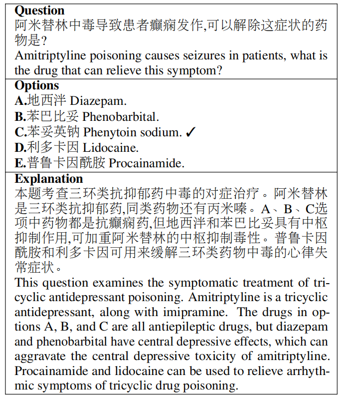

# ExplainCPE: A Free-text Explanation Benchmark of Chinese Pharmacist Examination

This is the main page of our [EMNLP 2023](https://2023.emnlp.org/) paper [**ExplainCPE**](https://arxiv.org/abs/2305.12945).


## Contents

- [Overview](#overview)
- [Dataset](#dataset)
- [Benckmark](#benchmark)
- [Citation](#citation)

## Overview

ExplainCPE is a challenging medical benchmark in Simplified Chinese, aimed at testing the medical interpretability of LLMs.

Additionally, we have collected over 7,000 instances from various sources, including the internet and exercise books about The National Licensed Pharmacist Examination in China.

Following is the structure of the repository.
- ``dataset`` directory contains train, dev and test set.
- ``dataset/results`` directory contains responses of LLMs.


## Dataset

### Data Statistics

|     | # Train |  # Dev | # Test |
| ----  | ---- | ---- | ---- |
|  Question   | 6867 | 500 | 189 |
|  Avg. words of question   | 28.31 | 28.44 | 37.79 |
|  Avg. words of option   | 8.12 | 8.55 | 9.76 |
|  Avg. words of explanation  | 120.52  | 116.32 | 171.94|
|  Max words of question   | 338 | 259 | 164 |
|  Max words of option   | 146 | 95  | 57 |
|  Max words of explanation   | 1011 | 604 | 685 |
Options per problem |   |  5  |   |

### Data Example



### Data Format


    {
    "id": 0,
    "question": "既可以通过口腔给药，又可以通过鼻腔、皮肤或肺部给药的剂型是",
    "options": [
        "口服液",
        "吸入制剂",
        "贴剂",
        "喷雾剂",
        "粉雾剂"
    ],
    "answer": "D",
    "explanation": "本题考查剂型的分类。喷雾剂多数是根据病情需要临时配制而成。喷雾剂的品种越来越多，既可作局部用药，亦可治疗全身性疾病。口服液为口服给药。吸入制剂为肺部给药。贴剂为皮肤给药。粉雾剂为肺部给药。故本题选D。"
    }

## Benchmark

| Model |  Acc(%) | Rouge-1 | Rouge-2 | Rouge-L |
| ----  | ---- | ---- | ---- | ---- |
|  GPT-4     | 75.7 | 0.384 | 0.140 | 0.247 |
|  ChatGPT   | 54.5 | 0.341 | 0.114 | 0.216 |
|  GPT-3.5   | 40.2 | - | - | - |
| ChatGLM-6B | 29.1 | 0.315 | 0.099 | 0.184 |
| BELLE-7B-2M| 33.3 | - | - | - |
|  ChatYuan  | 27.0 | - | - | - |

## Citation

If you use our dataset in your work, please cite us.

```bibtex
@misc{li2023emnlp,
  title = {ExplainCPE: A Free-text Explanation Benchmark of Chinese Pharmacist Examination},
  author = {Li, Dongfang and Yu, Jindi and Hu, Baotian and Xu, Zhenran and Zhang, Min},
  publisher = {arXiv},
  year = {2023},
  url = {https://arxiv.org/abs/2305.12945}
}
```

<!-- ## License

dataset is licensed under the Creative Commons Attribution-Share Alike License (CC-BY-SA). -->
